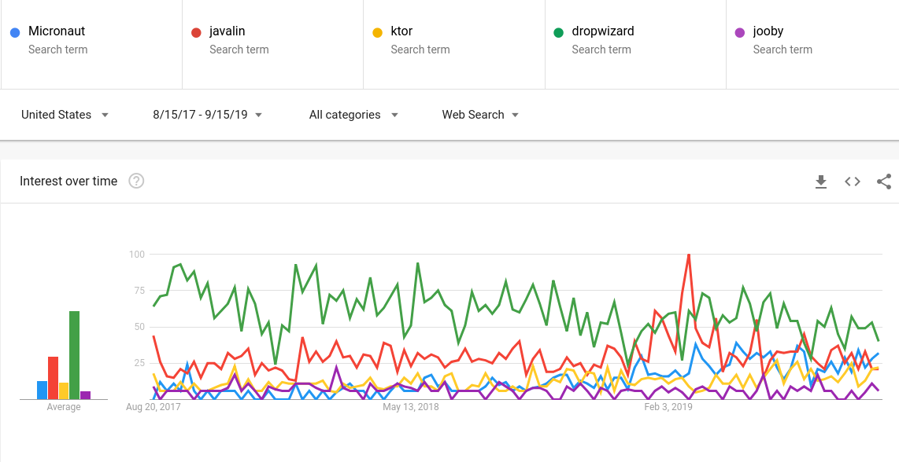

在一个行业待久了，有一个好处就是你可以把很多事情联系起来。就像中国历史的300年轮回周期律一样，Java从我入行的2005年到现在（2019）的这14年中就好像经历了好几个朝代一样，好多framework起起落落，最近又有一波兴起，让我不禁想起来14年前第一波的繁荣景象，当初MVC模式大兴其道，大部分框架都基于此，包括大名鼎鼎的[Struts](https://struts.apache.org/), [Webwork](https://en.wikipedia.org/wiki/WebWork),[Spring MVC](https://docs.spring.io/spring/docs/current/spring-framework-reference/web.html), 当然还有另外一个组件流派，代表项目有Sun自家的[JSF](https://en.wikipedia.org/wiki/JavaServer_Faces)，以及Apache旗下的[Tapestry](https://tapestry.apache.org/)。这些项目都负责前段的模型，后端则是一水的 Spring + Hibernate，和流行的Struts合在一起就是传说中的"SSH".现在回头看这些老家伙，好像只有Spring MVC在Spring的加持下，一路风雨走下来，过的还不错。当时有不少好事者把这些框架都收集起来加以点评和比较，在业内很受欢迎，其中我印象最深的就是[Matt Rabile](https://raibledesigns.com/)，他写了不少文章不说，后来干脆自己创建了一个快速启动框架[Appfuse](https://github.com/appfuse/appfuse)，让你自己来选择自己的前后台框架来快速搭建，有点类似现在的starter，比如[Spring的](https://start.spring.io/)，还有[Vertx的](https://start.vertx.io/)。顺便说下这位老兄，最近好像又盯上了新的风口： Angular + Spring boot, 比如他写的[这篇文章](https://developer.okta.com/blog/2019/05/13/angular-8-spring-boot-2)，以及他关注并贡献的[jhipster](https://github.com/jhipster/generator-jhipster)，有兴趣的朋友也可以跟风一下，话说回来，这也许就是这个行业内的一个有意思的地方，有的人负责创造，自然就有人负责跟随。

历史的车轮到了今天，在Java Web这块肥沃的土壤里又长出了众多茁壮的欣欣向荣的框架了，注意这次后面的架构思想是[Microservice](https://en.wikipedia.org/wiki/Microservices)，原因有好几个，一是硬件虚拟化技术的成熟导致比如Dokcer等部署方案的涌现，这样对于框架来说就大大简化了，加上Rest思想的深入人心，如何能够更快更简单的部署以及更灵活的扩展成了关注点；再一个原因就是Servlet大一统江湖的崩塌导致人心思变，各种Reactive Programming框架的兴起，我[这里](https://www.yuanqingfei.com/Kotlin%E4%B8%8EVertx/)有提及；另一个但不是最后一个的原因就是Functional Programming模式的兴起以及其他由其他语言激发出来的一些框架特点的引领。

在讨论这些微服务框架之前，我们先来看看大的图景，也就是主流大佬，我认为是这三巨头：

* [Spring/Spring-boot](https://spring.io/), 
* [Play Framework](https://www.playframework.com/)
* [Vert.x](https://vertx.io/)。

这三巨头基本上占据了半壁江山，下面所列的这些框架都是很有希望但是目前还都是小喽罗的角色。他们包括并不限于此列表的：

* [Akka http](https://doc.akka.io/docs/akka-http/current/index.html)
* [Micronaut](https://micronaut.io/)
* [Javalin](https://javalin.io/)
* [Sparkjava](http://sparkjava.com/)
* [Ktor](https://ktor.io/)
* [Jooby](https://jooby.io/)
* [Dropwizard](https://www.dropwizard.io/1.3.14/docs/)

关于这些框架的评论文章最好的三篇文章在[这里](https://www.e4developer.com/2018/06/02/the-rise-of-java-microframeworks/)，[这里](https://medium.com/@iliasyahia/the-state-of-java-kotlin-microframeworks-in-2018-54768edb7908)以及[这里](https://www.oodlestechnologies.com/blogs/Top-Five-Microframeworks-along-JVM/)。

## 一些数据

|            | Micronaut | Javalin | Sparkjava | Ktor  | Jooby | Dropwizard | Akka-http |
|------------|-----------|:-------:|-----------|-------|-------|------------|-----------|
| Kotlin支持 | Y         | Y       | Y         | Y     | Y     | N          | N         |
| 活跃开发度 | *****     | *****   | **        | ***** | ***** | *****      | *****     |
| Github星数 | 2756      | 3288    | 8467      | 5641  | 1069  | 7350       | 965       |

## google趋势 

从近两年的发展趋势来看，

* 上升趋势： Micronaut, Ktor, vertx
* 保持不变： Javalin, Jooby
* 下降趋势： Dropwizard, akka

## 性能比较

根据[Techempower](https://github.com/TechEmpower/FrameworkBenchmarks)的测试,大概性能排名如下

+-----+---------------------+-----------+--------------------------------+
|     | rank                | Framework | Performance (higher is better) |
+-----+---------------------+-----------+--------------------------------+
| 4   | vertx-postgres      | 44979     | 95.8%                          |
+-----+---------------------+-----------+--------------------------------+
| 9   | micronaut           | 33173     | 70.6%                          |
+-----+---------------------+-----------+--------------------------------+
| 30  | jooby2-jetty        | 25774     | 54.9%                          |
+-----+---------------------+-----------+--------------------------------+
| 60  | ktor                | 21046     | 44.8%                          |
+-----+---------------------+-----------+--------------------------------+
| 61  | akka-http           | 21039     | 44.8%                          |
+-----+---------------------+-----------+--------------------------------+
| 113 | spark               | 16014     | 34.1%                          |
+-----+---------------------+-----------+--------------------------------+
| 222 | dropwizard-postgres | 6607      | 14.1%                          |
+-----+---------------------+-----------+--------------------------------+

## 小结

综上，值得重点关注的是Vertx 和 Micronaut，本次讨论的主要是后端，下次讨论前段的webAseembly和cross platform programming的问题，先挖个坑。

## 感谢

感谢 https://www.tablesgenerator.com/text_tables 提供markdown的table generator.
