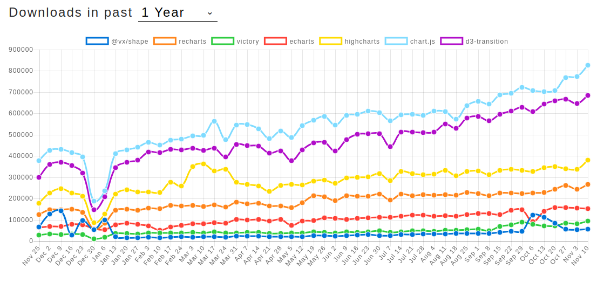

## 常见库



由此可见，两大巨头是[chartJs](https://github.com/chartjs/Chart.js) 和[d3](https://github.com/d3/d3)。 应该优先使用这两个。然后才是[highcharts](https://github.com/highcharts/highcharts)以及[recharts](https://github.com/recharts/recharts)。关于两巨头，[这里](https://www.createwithdata.com/d3js-or-chartjs/)有个很好的介绍。

## React整合情况

d3和chartJs都对react有比较好的支持。

### chartJs：

[react-chartjs-2](https://github.com/jerairrest/react-chartjs-2)

### d3

[vx](https://github.com/hshoff/vx)
[recharts](https://github.com/recharts/recharts)

个人感觉recharts封装更多，而vx相对较浅，如果是深度使用d3，应该是vx更友好些。如果想直接自己动手，其实可以参考[这篇文章](https://www.freecodecamp.org/news/how-to-get-started-with-d3-and-react-c7da74a5bd9f/)


## Kotlin支持情况

由于Kotlin整合的话，需要typescript定义文件先，本来打算使用vx，可惜它的文件还没有出来。根据[这里](https://github.com/hshoff/vx/issues/56)，[大概193版本才出来](https://github.com/hshoff/vx/projects/2)，但是[不打算内置动画支持](https://github.com/hshoff/vx/issues/6)

recharts有较好的[typscript定义文件](https://github.com/DefinitelyTyped/DefinitelyTyped/blob/master/types/recharts/index.d.ts) , 可惜动画支持[也没有多少](https://github.com/recharts/recharts/issues/287) 还有[这里](https://github.com/recharts/recharts/issues/375)

所以最后使用的[chartJs的定义文件](https://github.com/DefinitelyTyped/DefinitelyTyped/blob/master/types/chart.js/index.d.ts) 以及 [react-chartjs-2的定义文件](https://github.com/jerairrest/react-chartjs-2/blob/master/index.d.ts)

## 成果

[项目](https://github.com/yuanqingfei/dataVis-kotlin-react)

几个注意事项：

1. 没办法的时候直接上js("""xxx""")
2. setInterval:  `window.setInterval({chartReference.chartInstance.update()}, 3000)`
3. 如何用ref： 
    ```kotlin
        attrs{
            ref {
                reference:dynamic -> chartReference = reference
            }
        }
    ```
4. 由于目前kotlin不支持ES6，只是5.1，所以arrow function 是不支持的。感觉不爽。

