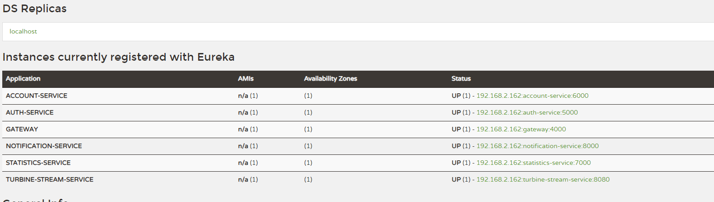

最近学习Spring Cloud，趁着假期，断断续续几天把github上比较流行的学习例子[piggymetrics](https://github.com/sqshq/piggymetrics)部署完成了，现在还没有启用docker，只是作为localhost service完成部署，这过程中踩了一些坑，这里总结一下。

## 架构

这个例子之所以经典，是因为它完全出于学习的目的，把[Spring Cloud](https://spring.io/projects/spring-cloud)的各个组件在云系统的使用中典型用例都包括了。基本的架构图如下所示：


## Eclipse的问题

之前自己习惯于命令行，所以都是使用`mvn eclipse:eclipse`生成项目配置，然后导入进去。结果这次偏偏出了问题，如下图所示


可以看到Eclipse默认会把application.properties排除在外，也就是无论你怎么更改配置，系统总是以第一次的编译结果为准，也就是第一次的配置文件为准，如果第一次没有配置对，以后怎样都不会对了。解决方法很简单，就是把这个excluded的东西都删掉就行了。

但是后来我又遇到类似的问题，即使excluded为NONE还是不行，出于某种未知的原因，总是导致项目不会使用`src/main/resource/`下面的配置信息。

最终的解决办法就是使用Eclipse中自己的Maven来生成项目，也就是直接导入Maven项目


## Spring Cloud版本问题

Spring Cloud是基于Spring Boot的，所以他们之间的版本必须匹配，可以参考[这里](https://spring.io/projects/spring-cloud)，也就是：

|Release Train |Boot Version 
--- | --- 
|2021.0.x aka Jubilee|2.6.x
|2020.0.x aka Ilford|2.4.x, 2.5.x (Starting with 2020.0.3)
|Hoxton|2.2.x, 2.3.x (Starting with SR5)
|Greenwich|2.1.x
|Finchley|2.0.x
|Edgware|1.5.x
|Dalston|1.5.x

目前只有头两个是出于正常维护状态中，其他版本均已终止维护了。piggymetrics项目目前是基于Finchley版本的，经过实验，也可以升级到Hoxton（Hoxton.SR12），当然有个小问题，下面会说，但是2020与2021版本目前还不行，将来我将尝试使用最新版本。

## Java版本问题

piggymetrics项目是使用Java 8的，但是如果你要是使用Java 11，你需要手工添加JAXB库。因为[Java 11移除了所有Java EE相关的东西](https://www.oracle.com/java/technologies/javase/11-relnote-issues.html#JDK-8190378):

* Java API for XML-Based Web Services (java.xml.ws)
* Java Architecture for XML Binding (java.xml.bind)
* JavaBeans Activation Framework (java.activation)
* Common Annotations (java.xml.ws.annotation)
* Common Object Request Broker Architecture (java.corba)
* JavaTransaction API (java.transaction)

但即便你添加了

```xml
<dependency>   
    <groupId>org.glassfish.jaxb</groupId>   
    <artifactId>jaxb-runtime</artifactId>   
    <version>2.3.2</version> 
</dependency>
```

或者

```xml
<dependency>
  <groupId>javax.xml.bind</groupId>
  <artifactId>jaxb-api</artifactId>
  <version>2.3.0</version>
</dependency>
<dependency>
  <groupId>com.sun.xml.bind</groupId>
  <artifactId>jaxb-core</artifactId>
  <version>2.3.0</version>
</dependency>
<dependency>
  <groupId>com.sun.xml.bind</groupId>
  <artifactId>jaxb-impl</artifactId>
  <version>2.3.0</version>
</dependency>
```

编译没有问题了，可是在运行的时候还会有[WARNING](https://www.dariawan.com/tutorials/java/using-jaxb-java-11/)，所以建议还是使用Java 8.

## BeanDefinitionOverrideException问题

这个问题在Finchley版本中是不存在的，当升级到Hoxton时就会爆出了，主要原因是从Spring boot v2.1开始，[不再允许默认Override的行为](https://github.com/spring-projects/spring-boot/wiki/Spring-Boot-2.1-Release-Notes#bean-overriding)。所以解决办法就是手工enable这个允许的行为

```yml
spring:
    main:
        allow-bean-definition-overriding: true
```

## AcitveMQ与RabbitMQ

其实很搞笑，项目说得很清楚，使用的是[RabbitMQ](https://github.com/rabbitmq/rabbitmq-server/releases)，我不知道那根筋搭错了，阴差阳错下载安装了ActiveMQ，结果死活不行，报错`AMQP protocol version mismatch; we are version 0-9-1, server sent signature 3,1,0,0`，还去RabbitMQ网站上查，[明明就支持AMQP 0-9-1的](https://www.rabbitmq.com/protocols.html)，后来才意识到自己用的是Active MQ，而它[只支持AMQP 1.0](https://activemq.apache.org/amqp)，而AMQP 1.0与AMQP 0-9-1是完全不同的，当然也就不兼容。

>Despite the name, AMQP 1.0 is a radically different protocol from AMQP 0-9-1 / 0-9 / 0-8, sharing essentially nothing at the wire level. AMQP 1.0 imposes far fewer semantic requirements; it is therefore easier to add support for AMQP 1.0 to existing brokers. The protocol is substantially more complex than AMQP 0-9-1, and there are fewer client implementations.

## MongoDB服务的问题

直接去[下载](https://www.mongodb.com/try/download/community?tck=docs_server&_ga=2.12591603.552439641.1640536151-1372320638.1640536151)本地安装就可以了，我也曾经尝试免费的Atlas在线服务，可是连接失败，报错`connection rest`，不知道是不是需要配置SSL的问题。没有继续深究。

在运行之前，需要创建用户以及数据库， 如下所示

```javascript
use piggymetrics
db.createUser( { user: "user",
                 pwd: "password",  
                 roles: [ { role: "clusterAdmin", db: "admin" },
                          { role: "readAnyDatabase", db: "admin" },
                          "readWrite"] },
               { w: "majority" , wtimeout: 5000 } );
```

## 本地运行localhost的问题

由于这个项目默认是要部署到docker上去的，所以不同的服务都有不同的名字，目前我为了体会功能，直接在Eclipse中运行，所以要修改一些名字到localhost。比如config server: `http://config:8888` --> `http://localhost:8888`， MongoDB 和 RabbitMQ的host都要做类似更改。

特别值得一提的是auth-service的问题，目前这个配置是会导致`java.net.UnknownHostException: auth-service`，需要在gateway和oathu2上面都改用localhost，如下所示：

```yml
security:
  oauth2:
    client:
      clientId: account-service
      clientSecret: ${ACCOUNT_SERVICE_PASSWORD}
      accessTokenUri: http://localhost:5000/uaa/oauth/token
      grant-type: client_credentials
      scope: server	
```

```yml
zuul:
  routes:
    auth-service:
        path: /uaa/**
        url: http://localhost:5000
        stripPrefix: false
        sensitiveHeaders:
```

最终可以在 http://localhost:8761/ 看到所有运行起来的服务




