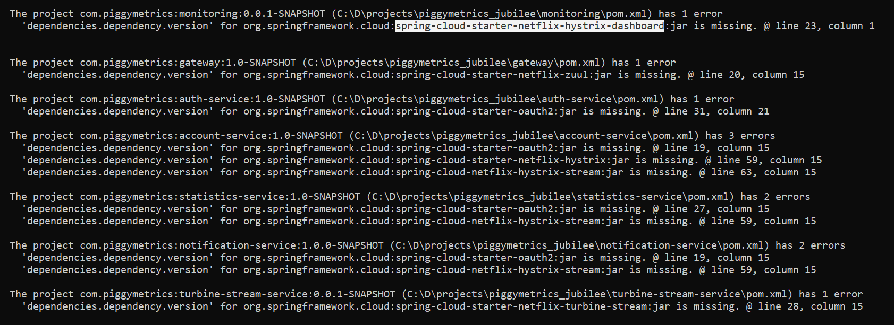

在维护那篇文章中，我们把Spring Cloud从Finchley到Hoxton，这里记录下从Hoxton升级到Jubilee（2021.0.0）的过程。

首先，根据Jubilee要求至少是Spring boot 2.6.1+，而之前的Hoxton只要求2.3.x，所以升级的时候，要指定正确的boot版本

```xml
<parent>
    <groupId>org.springframework.boot</groupId>
    <artifactId>spring-boot-starter-parent</artifactId>
    <version>2.6.2</version>
    <relativePath /> <!-- lookup parent from repository -->
</parent>

<properties>
    <project.build.sourceEncoding>UTF-8</project.build.sourceEncoding>
    <spring-cloud.version>2021.0.0</spring-cloud.version>
    <java.version>1.8</java.version>
</properties>
```

然后你就会发现编译不通过，有如下错误：



这是由于在新版本2020.0.x(Ilford)中，引入了如下[Break Changes](https://github.com/spring-cloud/spring-cloud-release/wiki/Spring-Cloud-2020.0-Release-Notes#breaking-changes)：

* Spring Cloud Security相关代码被迁移到Spring Cloud Common中。但是对于没有迁移的，仍然需要单独指定。

* Spring-cloud-netflix做了大幅精简，以下模块全被去掉，仍需要，则要单独指定。
```
spring-cloud-netflix-archaius
spring-cloud-netflix-concurrency-limits
spring-cloud-netflix-core
spring-cloud-netflix-dependencies
spring-cloud-netflix-hystrix
spring-cloud-netflix-hystrix-contract
spring-cloud-netflix-hystrix-dashboard
spring-cloud-netflix-hystrix-stream
spring-cloud-netflix-ribbon
spring-cloud-netflix-sidecar
spring-cloud-netflix-turbine
spring-cloud-netflix-turbine-stream
spring-cloud-netflix-zuul
spring-cloud-starter-netflix-archaius
spring-cloud-starter-netflix-hystrix
spring-cloud-starter-netflix-hystrix-dashboard
spring-cloud-starter-netflix-ribbon
spring-cloud-starter-netflix-turbine
spring-cloud-starter-netflix-turbine-stream
spring-cloud-starter-netflix-zuul
Support for ribbon, hystrix and zuul was removed across the release train projects.
```

具体来说就是在最顶级的pom文件中的dependency management加入下面的依赖就可以了。

```xml
    <dependency>
        <groupId>org.springframework.cloud</groupId>
        <artifactId>spring-cloud-starter-oauth2</artifactId>
        <version>2.2.5.RELEASE</version>
    </dependency>			

    <dependency>
        <groupId>org.springframework.cloud</groupId>
        <artifactId>spring-cloud-starter-netflix-hystrix</artifactId>
        <version>2.2.10.RELEASE</version>
    </dependency>
    <dependency>
        <groupId>org.springframework.cloud</groupId>
        <artifactId>spring-cloud-netflix-hystrix-stream</artifactId>
        <version>2.2.10.RELEASE</version>
    </dependency>
    <dependency>
        <groupId>org.springframework.cloud</groupId>
        <artifactId>spring-cloud-starter-netflix-zuul</artifactId>
        <version>2.2.10.RELEASE</version>
    </dependency>
    <dependency>
        <groupId>org.springframework.cloud</groupId>
        <artifactId>spring-cloud-starter-netflix-hystrix-dashboard</artifactId>
        <version>2.2.10.RELEASE</version>
    </dependency>
    <dependency>
        <groupId>org.springframework.cloud</groupId>
        <artifactId>spring-cloud-starter-netflix-turbine-stream</artifactId>
        <version>2.2.10.RELEASE</version>
    </dependency>
```

还有另外一个小小的改变，新版本的Spring test套件不再包含junit，所以也需要额外指定，直接在最顶级pom里面加上即可。
```xml
	<dependencies>
		<dependency>
			<groupId>junit</groupId>
			<artifactId>junit</artifactId>
			<scope>test</scope>
		</dependency>
	</dependencies>
```

接下来运行的时候，你会遇到这个错误

```
org.springframework.cloud.commons.ConfigDataMissingEnvironmentPostProcessor$ImportException: No spring.config.import set
	at org.springframework.cloud.commons.ConfigDataMissingEnvironmentPostProcessor.postProcessEnvironment(ConfigDataMissingEnvironmentPostProcessor.java:80)
	at org.springframework.boot.env.EnvironmentPostProcessorApplicationListener.onApplicationEnvironmentPreparedEvent(EnvironmentPostProcessorApplicationListener.java:102)
	at org.springframework.boot.env.EnvironmentPostProcessorApplicationListener.onApplicationEvent(EnvironmentPostProcessorApplicationListener.java:87)
```
这个的原因是由于新版本引入的另外一个Break Change造成的。

* Spring Cloud Commons的Bootstrap被默认禁用。导入配置的新方法采用Spring Boot 2.4新出的spring.config.import功能。同时spring.config.import加入了对解密的支持。对于Config Client、Consul、Vault和Zookeeper的配置导入细节可参阅相应文档。如果你需要使用原来的配置引导功能，那么需要将org.springframework.cloud:spring-cloud-starter-bootstrap依赖引入到工程中。

所以需要在最顶级的pom中加入依赖即可

```xml
	<dependencies>
        <dependency>
            <groupId>org.springframework.cloud</groupId>
            <artifactId>spring-cloud-starter-bootstrap</artifactId>
        </dependency>
    </dependencies>
```

* Spring Security 问题，虽然上面通过引入spring security oauth2解决了编译问题，但是，运行时会遇到下面的问题

```
Description:

Field accessTokenContextRelay in org.springframework.cloud.commons.security.ResourceServerTokenRelayAutoConfiguration$ResourceServerTokenRelayRegistrationAutoConfiguration required a bean of type 'org.springframework.cloud.commons.security.AccessTokenContextRelay' that could not be found.

The injection point has the following annotations:
	- @org.springframework.beans.factory.annotation.Autowired(required=true)


Action:

Consider defining a bean of type 'org.springframework.cloud.commons.security.AccessTokenContextRelay' in your configuration.
```


这个问题，有人在github上向Spring[报告过](https://github.com/spring-cloud/spring-cloud-security/issues/251)，但是双方都不知道对方在说什么。其实问题根源很简单，就是由于部分Security代码已经迁移到Spring Cloud Common中去，而系统中，现在有两套重复的代码，当然就不行了，解决办法就是排除掉老的。如下：

```xml
    <dependency>
        <groupId>org.springframework.cloud</groupId>
        <artifactId>spring-cloud-starter-oauth2</artifactId>
        <exclusions>
            <exclusion>
                <groupId>org.springframework.cloud</groupId>
                <artifactId>spring-cloud-security</artifactId>
            </exclusion>
        </exclusions>
    </dependency>
```
另外，`org.springframework.cloud.security.oauth2.client.feign.OAuth2FeignRequestInterceptor`也已经更名为`org.springframework.cloud.openfeign.security.OAuth2FeignRequestInterceptor`

结果，我又遇到另外一个问题。

```
Description:

The dependencies of some of the beans in the application context form a cycle:

┌──->──┐
|  org.springframework.cloud.netflix.hystrix.stream.HystrixStreamAutoConfiguration (field private org.springframework.cloud.netflix.hystrix.stream.HystrixStreamProperties org.springframework.cloud.netflix.hystrix.stream.HystrixStreamAutoConfiguration.properties)
└──<-──┘


Action:

Relying upon circular references is discouraged and they are prohibited by default. Update your application to remove the dependency cycle between beans. As a last resort, it may be possible to break the cycle automatically by setting spring.main.allow-circular-references to true.
```

这个循环依赖的问题是由于从Spring boot 2.6.0开始[默认禁止循环依赖](https://github.com/spring-projects/spring-boot/wiki/Spring-Boot-2.6-Release-Notes)了。所以需要手动允许。

```yml
spring:
  main:
    allow-circular-references: true
```

然后就可以正常启动了。

期待不要有问题了，结果还是有，啥也别说，这就是人生。

```
java.lang.NoSuchMethodError: org.springframework.boot.web.servlet.error.ErrorController.getErrorPath()Ljava/lang/String;
	at org.springframework.cloud.netflix.zuul.web.ZuulHandlerMapping.lookupHandler(ZuulHandlerMapping.java:87) ~[spring-cloud-netflix-zuul-2.2.10.RELEASE.jar:2.2.10.RELEASE]
	at org.springframework.web.servlet.handler.AbstractUrlHandlerMapping.getHandlerInternal(AbstractUrlHandlerMapping.java:152) ~[spring-webmvc-5.3.14.jar:5.3.14]
	at org.springframework.web.servlet.handler.AbstractHandlerMapping.getHandler(AbstractHandlerMapping.java:498) ~[spring-webmvc-5.3.14.jar:5.3.14]
	at org.springframework.web.servlet.DispatcherServlet.getHandler(DispatcherServlet.java:1261) ~[spring-webmvc-5.3.14.jar:5.3.14]
	at org.springframework.web.servlet.DispatcherServlet.doDispatch(DispatcherServlet.java:1043) ~[spring-webmvc-5.3.14.jar:5.3.14]
	at org.springframework.web.servlet.DispatcherServlet.doService(DispatcherServlet.java:963) ~[spring-webmvc-5.3.14.jar:5.3.14]
	at org.springframework.web.servlet.FrameworkServlet.processRequest(FrameworkServlet.java:1006) ~[spring-webmvc-5.3.14.jar:5.3.14]
	at org.springframework.web.servlet.FrameworkServlet.doGet(FrameworkServlet.java:898) ~[spring-webmvc-5.3.14.jar:5.3.14]
	at javax.servlet.http.HttpServlet.service(HttpServlet.java:655) ~[tomcat-embed-core-9.0.56.jar:4.0.FR]
```

还真是，Spring Cloud 已经不带Ribbon,Hystrix,Zuul玩了，还好有人自己动手利用PostProcessor[解救了自己](https://stackoverflow.com/questions/68100671/nosuchmethoderror-org-springframework-boot-web-servlet-error-errorcontroller-ge)。这样这个问题也算解决了。

问题继续，这次不是ZUUL了，是Ribbon，果然好兄弟就是要一起出现。

```
com.netflix.zuul.exception.ZuulException: Forwarding error
	at org.springframework.cloud.netflix.zuul.filters.route.RibbonRoutingFilter.handleException(RibbonRoutingFilter.java:198) ~[spring-cloud-netflix-zuul-2.2.10.RELEASE.jar:2.2.10.RELEASE]
	at org.springframework.cloud.netflix.zuul.filters.route.RibbonRoutingFilter.forward(RibbonRoutingFilter.java:173) ~[spring-cloud-netflix-zuul-2.2.10.RELEASE.jar:2.2.10.RELEASE]
	at org.springframework.cloud.netflix.zuul.filters.route.RibbonRoutingFilter.run(RibbonRoutingFilter.java:119) ~[spring-cloud-netflix-zuul-2.2.10.RELEASE.jar:2.2.10.RELEASE]
	at com.netflix.zuul.ZuulFilter.runFilter(ZuulFilter.java:117) ~[zuul-core-1.3.1.jar:1.3.1]
    ......
Caused by: com.netflix.client.ClientException: Load balancer does not have available server for client: account-service
	at com.netflix.loadbalancer.LoadBalancerContext.getServerFromLoadBalancer(LoadBalancerContext.java:483) ~[ribbon-loadbalancer-2.3.0.jar:2.3.0]
	at com.netflix.loadbalancer.reactive.LoadBalancerCommand$1.call(LoadBalancerCommand.java:184) ~[ribbon-loadbalancer-2.3.0.jar:2.3.0]
```

这个问题很多人认为是要在Zuul中加上下面的配置才行：

```yml
ribbon:
  eureka:
    enable: true 
```
结果并不行。经过半天的各种尝试，突然顿悟，问题已经很清楚了，新版本的Spring Cloud已经放弃Ribbon，即使有库，在运行时也没有load balancer了。我曾经尝试直接加上`spring-cloud-start-loadbalancer`的依赖，结果也不行。路走到这里，说明项目要大改了，要用Spring Gateway代替Zuul，用Spring LB代替Ribbon。下回分解。