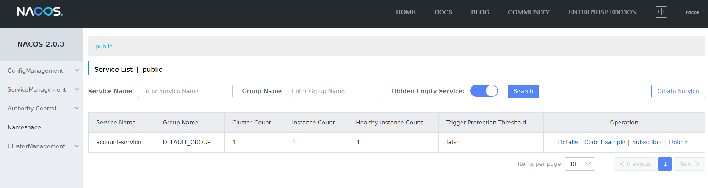

注： 如果想直接看代码，点击[这里](https://github.com/yuanqingfei/piggymetrics/tree/jubilee_alibaba)

完成升级到Jubilee后，我们继续向前，第一步是尝试使用Alibaba套件。主要是Nacos，用来来替换原先系统中的Registry Server和Config Server。

首先是加入依赖，注意老版本groupId是`org.springframework.cloud`，新版本已经叫`com.alibaba.cloud`，当然artifactId`spring-cloud-alibaba-dependencies`没有变。不得不说，咱中国人现在越来越有发言权了，这个东西确实是中国人搞出来的，这个groupId改了也没毛病。唯一一个小问题就是在Spring所有子项目中显得有些不一样，毕竟NetFlix也贡献了不少，不过人家既然开源就接受了spring的收编，就接受了Spring的groupId，毕竟整个上层的抽象和架构都是Spring团队搞出来的，改groupId稍微有点小家子气。有些扯远了，回来。

```xml
    <dependency>
        <groupId>com.alibaba.cloud</groupId>
        <artifactId>spring-cloud-alibaba-dependencies</artifactId>
        <version>2021.1</version>
        <type>pom</type>
        <scope>import</scope>
    </dependency>
```

## Registry

整个Registry项目都可以删除了，因为外部有个Nacos可以代劳了。

然后在所有子项目中增加：

```xml
    <dependency>
        <groupId>com.alibaba.cloud</groupId>
        <artifactId>spring-cloud-starter-alibaba-nacos-discovery</artifactId>
    </dependency>
```

删除：

```xml
    <dependency>
        <groupId>org.springframework.cloud</groupId>
        <artifactId>spring-cloud-starter-netflix-eureka-client</artifactId>
    </dependency>
```

配置方面

删除Eureka的配置

```yml
eureka:
  instance:
    prefer-ip-address: true
  client:
    serviceUrl:
      defaultZone: http://registry:8761/eureka/
```

增加部分：

```yml
spring:
  cloud:
    nacos:
      discovery:
        server-addr: localhost:8848
```

在我们已经用命令`cmd startup.cmd -m standalone`启动Nacos的前提下，启动就可以看见这个Service了。




## Config

自然是可以删除Config整个项目了，另外其他项目中关于Config的配置也需要了。

删除：

```yml
spring:
   cloud:
    config:
      uri: http://localhost:8889
      fail-fast: true
      password: ${ACCOUNT_SERVICE_PASSWORD}
      username: user
```

增加依赖：

```xml
    <dependency>
        <groupId>com.alibaba.cloud</groupId>
        <artifactId>spring-cloud-starter-alibaba-nacos-config</artifactId>
    </dependency>
```

然后把部分配置就可以转移到Nacos中，只要保证DataId(后缀名可以是yaml或者properties)与此应用的名字(`spring.application.name`)匹配即可。

```yml
spring:
  application:
    name: account-service
  cloud:
    nacos:
      config:
        server-addr: localhost:8848
        file-extension: yaml
  main:
    allow-bean-definition-overriding: true
    allow-circular-references: true 
```

值得注意的是，如果是保存为yml格式，需要增加`file-extension`配置。实际上，如果你配置了config address，就不需要配置discovery address，因为他们是一体的，没有必要重复。

DataId的原始含义： ${spring.cloud.nacos.config.prefix}-${spring.profile.active}.${spring.cloud.nacos.config.file-extension}

### Profile

```properties
spring.profiles.active=DEV
```

### Group

```properties
spring.cloud.nacos.config.group=DEV_GROUP
```

### Namespace

```properties
spring.cloud.nacos.config.namespace=83eed625-d166-4619-b923-93df2088883a
```

### 统一配置

```properties
spring.cloud.nacos.config.ext-config[0].data-id=actuator.properties
spring.cloud.nacos.config.ext-config[0].group=DEFAULT_GROUP
spring.cloud.nacos.config.ext-config[0].refresh=true
spring.cloud.nacos.config.ext-config[1].data-id=log.properties
spring.cloud.nacos.config.ext-config[1].group=DEFAULT_GROUP
spring.cloud.nacos.config.ext-config[1].refresh=true
```

### 分享配置

```properties
spring.cloud.nacos.config.shared-dataids=actuator.properties,log.properties
spring.cloud.nacos.config.refreshable-dataids=actuator.properties,log.properties
```

shareids这种方式的优先级低于ext-config的方式，当然也低于普通的配置。

## Sentinel

这个服务是用来做服务保障的，地位类似于过去的Hysrtrix，以及现在的resilence4j。但它是独立运行的，如果要整合，需要先增加依赖。

```xml
    <dependency>
        <groupId>org.springframework.cloud</groupId>
        <artifactId>spring-cloud-starter-alibaba-sentinel</artifactId>
    </dependency>
```

如果要用Nacos来持久化规则，加上下面的依赖

```xml
    <dependency>
        <groupId>com.alibaba.csp</groupId>
        <artifactId>sentinel-datasource-nacos</artifactId>
        <version>1.8.3</version>
    </dependency>
```

配置里面增加一条

```yml
spring:
  cloud:
    sentinel: 
      transport:
        dashboard: localhost:8080
```

如果用到Nacos的情况下

```yml
spring:
  cloud:
    sentinel: 
      datasource:
        ds:
          nacos:
            server-addr: localhost:8848
            dataId: account-service
            groupId: DEFAULT_GROUP
            rule-type: flow
```

当然Sentinel还支持`@SentinelResource`等更具体的用法，总体而言，还是比较直接的。明天开始弄Kubernates，据说比较复杂。


