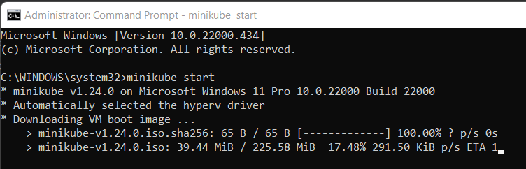

应该说如果Alibaba出的几个组件时对Spring Cloud的有益补充，而K8s则更像一个庞然大物，涵盖的范围也更广。有人总结了下图：


应该说他们有重合，但是侧重点又有所不同，如果整合起来，岂不爽哉，[Spring Cloud K8s](https://spring.io/projects/spring-cloud-kubernetes#overview)的出发点也就是如此。如果想了解更多这两者之间的异同和关系，[这篇文章](https://blog.csdn.net/weixin_45987961/article/details/122500704)总结的很好。但是也有人[不看好这两者的整合](https://zhuanlan.zhihu.com/p/339736610)，认为Spring Cloud局限于Java，而K8s的发展才是正道，和Spring Cloud终将脱轨。

虽然有很多功能重叠，这里决定还是只把Config和Registry交出去，其他仍然依赖Spring Cloud。Alibaba Nacos是通过暴露一个URL就行，简单粗暴。而Kubernate由于更加庞大/侵入性，需要借助于它的Java客户端： [Fabric8](https://github.com/fabric8io/kubernetes-client) 或者 [官方Client](https://github.com/kubernetes-client/java)。

Nacos的Registry都可以通过配置URL就可以，所以可以本地运行而不需要真正部署，而K8s要求所有MicroService都必须真正部署上去才行，否则不能提供相应的服务。所以准备工作有点烦，必须把一个最小版本的云环境建立起来。当然，这种要求也带来了联调的不方便。

## 安装MiniKube

根据[指南](https://minikube.sigs.k8s.io/docs/start/)，安装完毕。然后添加到Path环境变量里面去。然后`minikube start`，就可以看到如下图所示开始下载Minikube的镜像：



安装完成之后再把`kubectl`也安装上。如下：


这中间会遇到这样一个错误：

```
! This VM is having trouble accessing https://k8s.gcr.io
* To pull new external images, you may need to configure a proxy: https://minikube.sigs.k8s.io/docs/reference/networking/proxy/
```

在[官方网站上](https://github.com/kubernetes/minikube/issues/7913#issuecomment-619558192)，给出如下建议：

>Open Hyper-V Manager, Click on Virtual Switch Manager, Create New Virtual Network Switch, Select external type, and OK. I suggest naming the switch something simple like minikube, then run command: `minikube start --hyperv-virtual-switch=minikube` 

试过，但是没有用。

也有人建议`minikube start --driver=docker`，这种方式没有尝试。


## 安装Docker

目前我安装的是的Docker Desktop 4.4.3 windows版本。安装的主要目的就是能在本机执行docker命令，可以和Minikube里面的Docker Dameon取得联系。安装完成之后需要配置一下，因为在国内下载默认镜像站点实在太慢了，需要用国内大厂的docker hub镜像。由于我们使用的是Docker Desktop，所以请参照下图：


我上面选用的官方国内镜像和Docker 中国的，当然也可以选用其他的如腾讯云和阿里云。

Minikube有个好处就是它已经集成了Docker, 你可以利用里面的这个Docker Daemon来工作，想想还是挺神奇的。Linux环境下可以通过下面的命令：

```bash
eval $(minikube docker-env)
```

Windows PowerShell 命令（需要以Admin的方式启动）：

```powershell
& minikube -p minikube docker-env --shell powershell | Invoke-Expression
```

然后你可以用下面的命令来验证

```
PS C:\WINDOWS\system32> kubectl get nodes
NAME       STATUS   ROLES                  AGE   VERSION
minikube   Ready    control-plane,master   12h   v1.22.3
PS C:\WINDOWS\system32> kubectl get svc -A
NAMESPACE     NAME         TYPE        CLUSTER-IP   EXTERNAL-IP   PORT(S)                  AGE
default       kubernetes   ClusterIP   10.96.0.1    <none>        443/TCP                  12h
kube-system   kube-dns     ClusterIP   10.96.0.10   <none>        53/UDP,53/TCP,9153/TCP   12h
```

## 配置Fabric8 Maven Plugin来推送service到K8S/minikube

Fabric8 [Maven plugin](https://maven.fabric8.io/) 功能强大，这里我们定义三个Profile，我们目前只使用Kubernetes这个。

```xml
	<profiles>
		<profile>
			<id>kubernetes</id>
			<build>
				<plugins>
					<plugin>
						<groupId>io.fabric8</groupId>
						<artifactId>fabric8-maven-plugin</artifactId>
						<version>${fabric8.maven.plugin.version}</version>
						<executions>
							<execution>
								<id>fmp</id>
								<goals>
									<goal>resource</goal>
									<goal>build</goal>
								</goals>
							</execution>
						</executions>
						<configuration>
							<enricher>
								<config>
									<fmp-service>
										<type>NodePort</type>
									</fmp-service>
								</config>
							</enricher>
						</configuration>
					</plugin>
				</plugins>
			</build>
		</profile>
		<profile>
			<id>release</id>
			<build>
				<plugins>
					<plugin>
						<groupId>io.fabric8</groupId>
						<artifactId>fabric8-maven-plugin</artifactId>
						<version>${fabric8.maven.plugin.version}</version>
						<executions>
							<execution>
								<id>fmp</id>
								<goals>
									<goal>resource</goal>
									<goal>helm</goal>
								</goals>
							</execution>
						</executions>
					</plugin>
				</plugins>
			</build>
		</profile>

		<profile>
			<id>integration</id>
			<build>
				<plugins>
					<plugin>
						<groupId>io.fabric8</groupId>
						<artifactId>fabric8-maven-plugin</artifactId>
						<version>${fabric8.maven.plugin.version}</version>
						<executions>
							<execution>
								<id>fmp</id>
								<goals>
									<goal>resource</goal>
									<goal>build</goal>
								</goals>
							</execution>
						</executions>
					</plugin>
					<plugin>
						<groupId>org.apache.maven.plugins</groupId>
						<artifactId>maven-failsafe-plugin</artifactId>
						<version>${maven-failsafe-plugin.version}</version>
						<executions>
							<execution>
								<id>run-integration-tests</id>
								<phase>integration-test</phase>
								<goals>
									<goal>integration-test</goal>
									<goal>verify</goal>
								</goals>
							</execution>
						</executions>
						<configuration>
							<skipTests>false</skipTests>
							<skipITs>false</skipITs>
						</configuration>
					</plugin>
				</plugins>
			</build>
		</profile>
	</profiles>
```

```bash
mvn clean package fabric8:deploy -Pkubernetes
```
结果如下：
```
[INFO] <<< fabric8-maven-plugin:4.4.1:deploy (default-cli) < install @ account-service <<<
[INFO]
[INFO]
[INFO] --- fabric8-maven-plugin:4.4.1:deploy (default-cli) @ account-service ---
[INFO] F8: Using Kubernetes at https://172.22.98.243:8443/ in namespace default with manifest C:\D\projects\yuan\piggymetrics\account-service\target\classes\META-INF\fabric8\kubernetes.yml
[INFO] F8: Using namespace: default
[INFO] F8: Using namespace: default
[INFO] F8: Creating a Service from kubernetes.yml namespace default name account-service
[INFO] F8: Created Service: account-service\target\fabric8\applyJson\default\service-account-service.json
[INFO] F8: Using namespace: default
[INFO] F8: Creating a Deployment from kubernetes.yml namespace default name account-service
[INFO] F8: Created Deployment: account-service\target\fabric8\applyJson\default\deployment-account-service.json
[INFO] F8: HINT: Use the command `kubectl get pods -w` to watch your pods start up
[INFO] ------------------------------------------------------------------------
[INFO] BUILD SUCCESS
[INFO] ------------------------------------------------------------------------
```

然后可以验证下：
```
PS C:\D\projects\yuan\piggymetrics\account-service> kubectl get deployment
NAME              READY   UP-TO-DATE   AVAILABLE   AGE
account-service   0/1     1            0           10h 

PS C:\D\projects\yuan\piggymetrics\account-service> kubectl get service
NAME              TYPE        CLUSTER-IP       EXTERNAL-IP   PORT(S)          AGE
account-service   NodePort    10.103.243.129   <none>        8080:31365/TCP   136m
kubernetes        ClusterIP   10.96.0.1        <none>        443/TCP          15h
```

接着就可以尝试访问了，用下面的命令取得外部地址（当然这个例子中服务是没有READY的，也是不可访问的）：

```
PS C:\D\projects\yuan\piggymetrics\account-service> minikube service account-service --url
http://172.22.98.243:31365
```

## 激活Minikube Dashboard

```
PS C:\D\projects\yuan\piggymetrics\account-service> minikube dashboard --url
* Verifying dashboard health ...
* Launching proxy ...
* Verifying proxy health ...
http://127.0.0.1:55306/api/v1/namespaces/kubernetes-dashboard/services/http:kubernetes-dashboard:/proxy/
```
拿到上面的地址，就可以在本机访问K8s，可以方便地看到里面的部署并可以进行一些操作。如下图所示：


## 总结一下

上面的准备，主要就是minikube，这是一个K8s完整的环境，背后的逻辑就是，通过本地的docker和miniKube里面的docker daemon建立联系，然后把build好的img推送上去，核心还是使用docker的命令。
