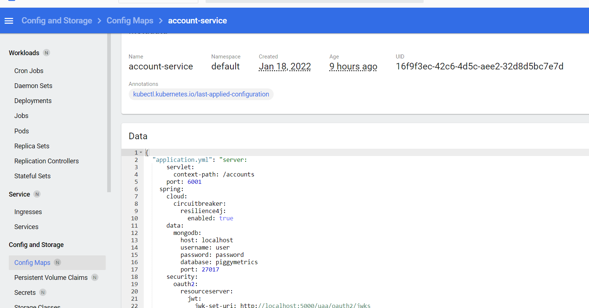

现在我们知道如何快速部署项目到K8s的环境了，现在开始修改项目。

在顶层增加依赖

```xml
    <dependency>
        <groupId>org.springframework.cloud</groupId>
        <artifactId>spring-cloud-starter-kubernetes-fabric8-all</artifactId>
        <version>2.1.0</version>
        <type>pom</type>
        <scope>import</scope>
    </dependency>
```

现在可以删除整个Config 项目，在其他项目添加依赖:

```xml
<dependency>
    <groupId>org.springframework.cloud</groupId>
    <artifactId>spring-cloud-starter-kubernetes-fabric8-config</artifactId>
</dependency>
```

配置删除：

```yml
spring:
   cloud:
    config:
      uri: http://localhost:8889
      fail-fast: true
      password: ${ACCOUNT_SERVICE_PASSWORD}
      username: user
```

增加配置：

```yml
spring:
  cloud:
    kubernetes:
      config:
        sources:
          - name: ${spring.application.name}
            namespace: default
```
由于我们直接把服务部署到K8s中去，所以不需要配置连接信息，但是需要在代码中来指定你需要那些Config信息，这些信息需要事先配置到K8s的ConfigMap中去。在上面的配置中，我们要用到的是default的namespace下面的信息，而且name要和application的名字匹配下来。然后我们就可以增加配置信息到ConfigMap中去了，不像Nacos有GUI那么方便，这里是通过命令来把配置文件加载到K8s的ConfigMap中去。

创建一个配置文件，里面包含嵌入式的真实配置信息：

```yml
kind: ConfigMap
apiVersion: v1
metadata:
  name: account-service
data:
   application.yml: |-
      server:
        servlet:
          context-path: /accounts
        port: 6001 
      spring:
        cloud:
          circuitbreaker:
            resilience4j:
              enabled: true
```

然后用下面命令把配置信息上传到K8s中去。
```bash
PS C:\D\projects\yuan\piggymetrics\account-service\src\main\k8s> kubectl apply -f .\account-service.yml
configmap/account-service created
```

我们在Dashboard中可以清楚地看到确实已经更新到K8s上去了。



因为要访问ConfigMap的API，所以要提升权限

```
PS C:\D\projects\yuan\piggymetrics\account-service> kubectl create clusterrolebinding permissive-binding --clusterrole=cluster-admin --user=admin --user=kubelet --group=system:serviceaccounts
clusterrolebinding.rbac.authorization.k8s.io/permissive-binding created
```


### Registry

整个Registry项目都可以删除了。

然后在所有子项目中增加：

```xml
    <dependency>
        <groupId>org.springframework.cloud</groupId>
        <artifactId>spring-cloud-starter-kubernetes-fabric8</artifactId>
    </dependency>
```

删除：

```xml
    <dependency>
        <groupId>org.springframework.cloud</groupId>
        <artifactId>spring-cloud-starter-netflix-eureka-client</artifactId>
    </dependency>
```

配置方面

删除Eureka的配置

```yml
eureka:
  instance:
    prefer-ip-address: true
  client:
    serviceUrl:
      defaultZone: http://registry:8761/eureka/
```

增加部分：

```yml
spring:
  cloud:
    kubernetes:
      discovery:
        all-namespaces: true
        include-not-ready-addresses: true
```

目前并没有调通。想法改变，所以目前终止K8s的学习。