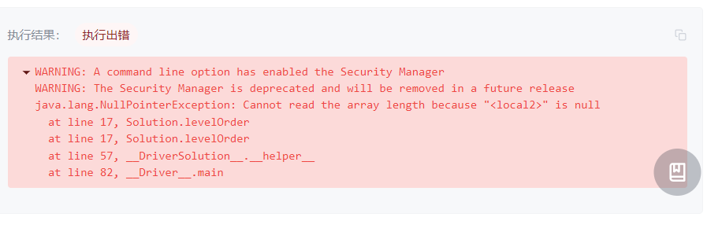

## 从上到下打印二叉树

```java
/**
 * Definition for a binary tree node.
 * public class TreeNode {
 *     int val;
 *     TreeNode left;
 *     TreeNode right;
 *     TreeNode(int x) { val = x; }
 * }
 */
class Solution {

    List<Integer> valList = new ArrayList<>();

    public int[] levelOrder(TreeNode root) {
        if(root == null) return null;    
        valList.add(root.val);
        for(int ele: levelOrder(root.left)) valList.add(ele);
        for(int ele: levelOrder(root.right)) valList.add(ele);
        // return valList.toArray(new int[valList.size()]);
        int[] result = new int[valList.size()];
        for(int i = 0; i < valList.size(); i ++) result[i] = valList.get(i);
        return result;
    }
}
```

本来挺简单的一个迭代就行了，可是现实遇到`return valList.toArray(new int[valList.size()])`编译不通过，改了写法后，又说循环有下面的问题：



后来仔细想下，这样即使成功也不是广度优先，而是深度优先。

原来这是典型的BFS（广度优先搜索问题），如下：

```java
class Solution {
    public int[] levelOrder(TreeNode root) {
        if(root == null) return new int[0];
        Queue<TreeNode> queue = new LinkedList<>(){{ add(root); }};
        ArrayList<Integer> ans = new ArrayList<>();
        while(!queue.isEmpty()) {
            TreeNode node = queue.poll();
            ans.add(node.val);
            if(node.left != null) queue.add(node.left);
            if(node.right != null) queue.add(node.right);
        }
        int[] res = new int[ans.size()];
        for(int i = 0; i < ans.size(); i++)
            res[i] = ans.get(i);
        return res;
    }
}
```

因为队列有FIFO的特性，可以看到出来自然也是头，左，右的顺序。
时间O(n)，空间O(n)

## 还是打印二叉树，但是每一层的要放在一起

```java
/**
 * Definition for a binary tree node.
 * public class TreeNode {
 *     int val;
 *     TreeNode left;
 *     TreeNode right;
 *     TreeNode(int x) { val = x; }
 * }
 */

class Solution {
    public List<List<Integer>> levelOrder(TreeNode root) {
        Queue<TreeNode> queue = new LinkedList<>();
        List<List<Integer>> res = new ArrayList<>();
        if(root != null) queue.add(root);
        while(!queue.isEmpty()) {
            List<Integer> tmp = new ArrayList<>();
            for(int i = queue.size(); i > 0; i--) {
                TreeNode node = queue.poll();
                tmp.add(node.val);
                if(node.left != null) queue.add(node.left);
                if(node.right != null) queue.add(node.right);
            }
            res.add(tmp);
        }
        return res;
    }
}
```

和上一个问题的答案区别就在于，中间用一个for循环来记录了当前层的数据，这样就可以满足要求了。这里面有个要注意的地方是要用递减，因为queue的size会改变，所以要用第一次的queue的大小来做这个for循环。
时间O(n), 空间O(n)

## 还是打印二叉树，但是每层顺序都相反

```java
/**
 * Definition for a binary tree node.
 * public class TreeNode {
 *     int val;
 *     TreeNode left;
 *     TreeNode right;
 *     TreeNode(int x) { val = x; }
 * }
 */

class Solution {
    public List<List<Integer>> levelOrder(TreeNode root) {
        Queue<TreeNode> queue = new LinkedList<>();
        List<List<Integer>> res = new ArrayList<>();
        if(root != null) queue.add(root);
        while(!queue.isEmpty()) {
            List<Integer> tmp = new ArrayList<>();
            boolean reverse = true;
            for(int i = queue.size(); i > 0; i--) {
                TreeNode node = queue.poll();
                tmp.add(node.val);
                if(reverse){
                    if(node.left != null) queue.add(node.right);
                    if(node.right != null) queue.add(node.left);
                } else {
                    if(node.left != null) queue.add(node.left);
                    if(node.right != null) queue.add(node.right);
                }
                reverse = !reverse;
            }
            res.add(tmp);
        }
        return res;
    }
}
```

注意，上面这个办法有执行问题。其实类似逻辑可以用如下，而且更简单：

```java
class Solution {
    public List<List<Integer>> levelOrder(TreeNode root) {
        Queue<TreeNode> queue = new LinkedList<>();
        List<List<Integer>> res = new ArrayList<>();
        if(root != null) queue.add(root);
        while(!queue.isEmpty()) {
            List<Integer> tmp = new ArrayList<>();
            for(int i = queue.size(); i > 0; i--) {
                TreeNode node = queue.poll();
                tmp.add(node.val);
                if(node.left != null) queue.add(node.left);
                if(node.right != null) queue.add(node.right);
            }
            if(res.size() % 2 == 1) Collections.reverse(tmp);
            res.add(tmp);
        }
        return res;
    }
}
```

另外就是用双头队列来加这个弹出元素：

```java
class Solution {
    public List<List<Integer>> levelOrder(TreeNode root) {
        Queue<TreeNode> queue = new LinkedList<>();
        List<List<Integer>> res = new ArrayList<>();
        if(root != null) queue.add(root);
        while(!queue.isEmpty()) {
            LinkedList<Integer> tmp = new LinkedList<>();
            for(int i = queue.size(); i > 0; i--) {
                TreeNode node = queue.poll();
                if(res.size() % 2 == 0) tmp.addLast(node.val); // 偶数层 -> 队列尾部
                else tmp.addFirst(node.val); // 奇数层 -> 队列头部
                if(node.left != null) queue.add(node.left);
                if(node.right != null) queue.add(node.right);
            }
            res.add(tmp);
        }
        return res;
    }
}
```